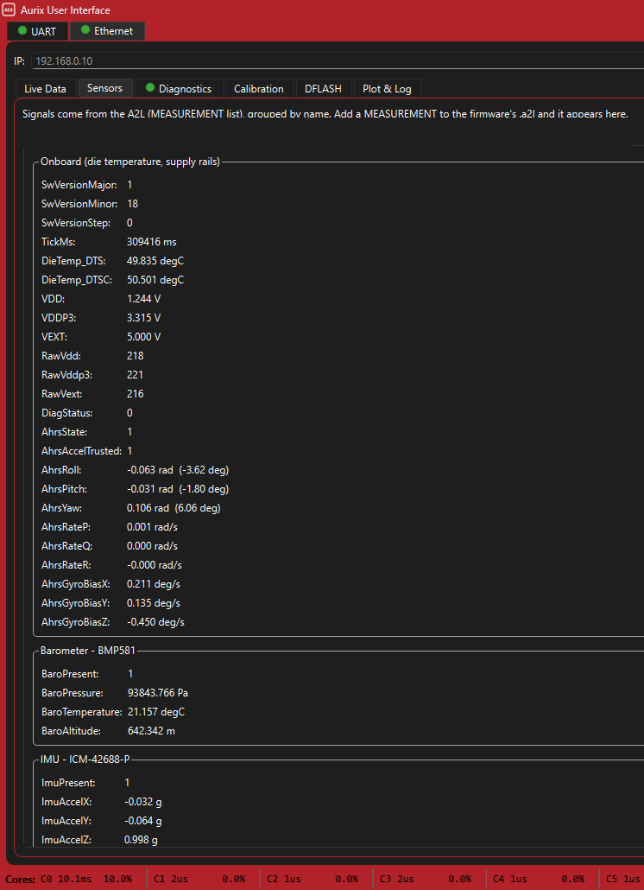
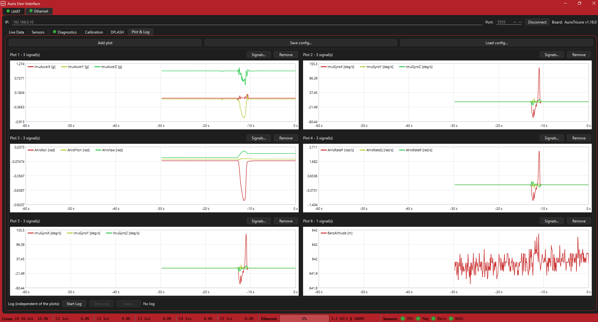

# AurixGUI — Measurement and Calibration Frontend

**ASPICE:** SWE.2 — software architecture/overview, GUI domain · realizes SYS-COM-001 (groundstation, R-008) · process: QuadSE/requirements/README.md

A C++/Qt6 desktop frontend for an AURIX TC399 ECU: watch measurements live,
calibrate parameters, read diagnostics, plot signals and record them as MF4 —
over **XCP on UDP**, described by the ECU's **A2L** file.

The tool is generic with respect to the ECU: channels, addresses, types and
conversions come from the A2L, not from a hard-wired list. A new measurement in
the firmware is nothing more than a new A2L entry here.

> **Firmware, XCP memory layout, A2L generation and protocol details are
> documented and maintained in the ECU repository:**
> **[crengineering/AurixTricore](https://github.com/crengineering/AurixTricore)**

---

## Features

| Tab | Contents |
|---|---|
| **UART** | Serial monitor (replaces PuTTY): pick a port, connect, follow the output |
| **Ethernet** | XCP connection to the ECU, A2L loading, connection status |
| **Live Data** | System overview, cyclically polled: software version, uptime, die temperatures (DTS/DTSC), supply rails (1.25 V / 3.3 V / 5 V), base measurements |
| **Sensors** | Sensor values grouped by device — IMU (ICM-42688-P), barometer (BMP581), magnetometer (MMC5983MA), GNSS (NEO-M9N). The tab is built at runtime from the loaded A2L |
| **Diagnostics** | Diagnostic bits as a table, decoded from the A2L description |
| **Calibration** | Read and write calibration values (RAM block) |
| **DFLASH** | Read, write and verify persistent parameters in the NVM block |
| **Plot & Log** | Freely configurable plots, channel selection, recording as **MF4** |

The MF4 recording is deliberately standard-conforming, so measurement files can
be evaluated without this tool — with asammdf, for instance.



*Sensors tab — the groups are built at runtime from the loaded A2L.*



*Plot & Log — freely configured plots over live XCP polling, recordable as MF4.*

---

## Requirements (Windows)

- Qt 6 (online installer), **MinGW** kit (brings the compiler and Ninja)
- CMake (included as a tool in the Qt installer)

## Build (MinGW, from the CLI)

Adjust the paths to your own Qt installation:

```bat
set QT=C:\Qt\6.11.1\mingw_64
set PATH=C:\Qt\Tools\mingw1310_64\bin;C:\Qt\Tools\Ninja;%PATH%

cmake -S . -B build -G Ninja -DCMAKE_PREFIX_PATH=%QT%
cmake --build build
```

Run:

```bat
build\SerialMonitor.exe
```

If Qt DLLs are missing at startup, once:

```bat
%QT%\bin\windeployqt.exe build\SerialMonitor.exe
```

The target is still named `SerialMonitor` from the first stage, when the tool was
nothing but a serial monitor.

---

## Layout

```
main.cpp            entry point, application configuration
mainwindow.*        frame window, tab structure, UART tab
titlebar.h          custom title bar (frameless window)
xcpclient.*         XCP-on-UDP client: connection, polling, reads and writes
xcppanel.*          the Ethernet, Live Data, Sensors, Diagnostics,
                    Calibration, DFLASH and Plot & Log tabs
a2lmodel.*          A2L parser: channels, addresses, types, conversions
plotwidget.*        plot rendering (own implementation, no third-party widget)
plotpane.*          plot management and channel selection
mf4writer.*         MF4 writer for measurement files
systemfooter.*      status bar
appicon.h           application icon
lampicon.h          per-tab status lamps
```

---

## Known pitfalls

- The COM port is opened **exclusively**. PuTTY and this tool cannot hold the
  same port at the same time — close PuTTY first.
- With an MSVC kit instead of MinGW: compile the UTF-8 sources with `/utf-8`
  (`target_compile_options(... /utf-8)` in `CMakeLists.txt`), otherwise umlauts
  come out wrong.
- If the loaded A2L does not match the flashed firmware, the GUI shows wrong
  values without warning — the addresses are shifted. When in doubt, check the
  version reported by the ECU against the A2L.

---

## License

[MIT](LICENSE) © 2026 Chris Riedl. Every source file checked in here is original
work; no third-party code is vendored. The third-party notice that ships with a
built binary is [NOTICE.txt](NOTICE.txt).

The application links against **Qt 6** (Widgets, SerialPort, Network,
Concurrent), which is not part of this repository and is used under the
**LGPL-3.0**. Distributing this repository as source triggers no LGPL
obligation. Anyone distributing a **compiled binary** has to satisfy LGPL-3.0
themselves: link Qt dynamically (the default), ship the Qt DLLs unmodified
alongside the executable, and include Qt's LGPL-3.0 license text and copyright
notice so the recipient can replace the Qt libraries with their own build.

No Qt module under a GPL-only or commercial-only license is used — no Qt Charts,
no Qt Data Visualization. The plot rendering in `plotwidget.cpp` /
`plotpane.cpp` is original work.

Qt® is a registered trademark of The Qt Company Ltd.; AURIX™, TriCore™ and
Infineon® are trademarks of Infineon Technologies AG; XCP, A2L and MF4 are
standards of ASAM e.V. All are named descriptively and imply no affiliation with,
or endorsement by, those organisations.

## Disclaimer

Private engineering project, not a product. The tool writes over XCP directly
into the memory of a running ECU (calibration values, GPIO and PWM outputs) and
can therefore put attached hardware into an unintended state. Not functionally
safe, not certified. Use at your own risk — see the warranty and liability
disclaimer in [`LICENSE`](LICENSE).
